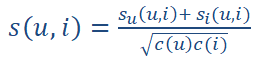
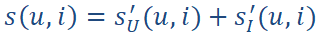
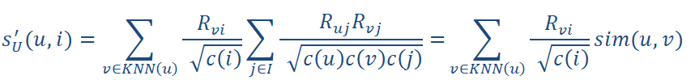
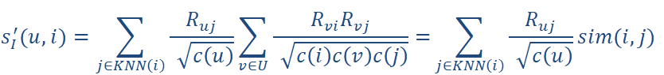

# K-Unified Nearest Neighbors Collaborative Filtering
This repository contains two Python implementations of the collaborative filtering algorithm for binary, positive-only data developed by Koen Verstrepen and Bart Goethals. The algorithm is described succinctly in 
[Verstrepen, K. and Goethals, B., 2014, October. Unifying nearest neighbors collaborative filtering. In *Proceedings of the 8th ACM Conference on Recommender systems* (pp. 177-184). ACM. Vancouver](http://adrem.ua.ac.be/~goethals/publications/pubs/verstrepen14kunn.pdf)
and also at greater length in chapter 3 of Koen Verstrepen's PhD thesis
[Verstrepen, K., 2015. *Collaborative Filtering with Binary, Positive-only Data: Proefschrift* (Doctoral dissertation).
Vancouver](http://win.ua.ac.be/~adrem/bibrem/pubs/verstrepen15PhDthesis.pdf).

### Why two implementations?
The algorithm as described in the above admits an obvious Python implementation which you can find [here](KUNN_slow_explicit.py). Here I implement everything in the first paper (though not yet the section **Explainability**) in a more or less naive way using explicit python for loops or numpy.vectorize. I have largely followed the notation in the first paper except for one difference: In the paper equation (10) is 

 

I incorporate the radicals into the equation to give 

(note, the apostrophes don't here denote differentiation) which then gives a neat definition of both sU(u,i) and sI(u,i) in terms of the already calculated similarity functions:

This is purely an efficiency saving to allow us to avoid recomputing too much stuff.

The [other implementation](KUNN.py) uses numpy operations (which are compiled, so faster) rather than python for loops, mainly matrix multiplications. This requires some thought to implement and understand but the results (as far as I have tested it) are the same as the slower version (apart from differences arising from comparing two things which both have similarity zero). On my machine this means that the results can be computed for 10,000 users and 5,000 items in about a minute, but multiply up to 100,000 users and because of the O(n^3) complexity of matrix multiplication the programme will run very slowly and then run out of memory (and you will need the Intel MKL linked version of Numpy even to get that far). Chapter 5 of Koen Verstrepen's PhD has some algorithms for finding the k nearest neighbors to a sparse vector in less time: An implementation of that (adapted to use the similarity metric from KUNN rather than cosine similarity) might allow the algorithm as a whole to scale a lot better but I haven't yet completed this yet.

### Usage
Both implementations implement a KUNN class. This should be called on your boolean matrix (which is assumed to be called R) along with the number of user and item neighbors to be used. Calling R.pred(user index) will then return the recommendations and new_recommendations (which is those items recommended which the user hasn't already interacted with) in descending order. In the slow implementation, calling R.pred() causes the results to be computed. In the fast (recommended) implementation the bulk of the work is done when KUNN is instantiated so the results are returned a lot quicker.